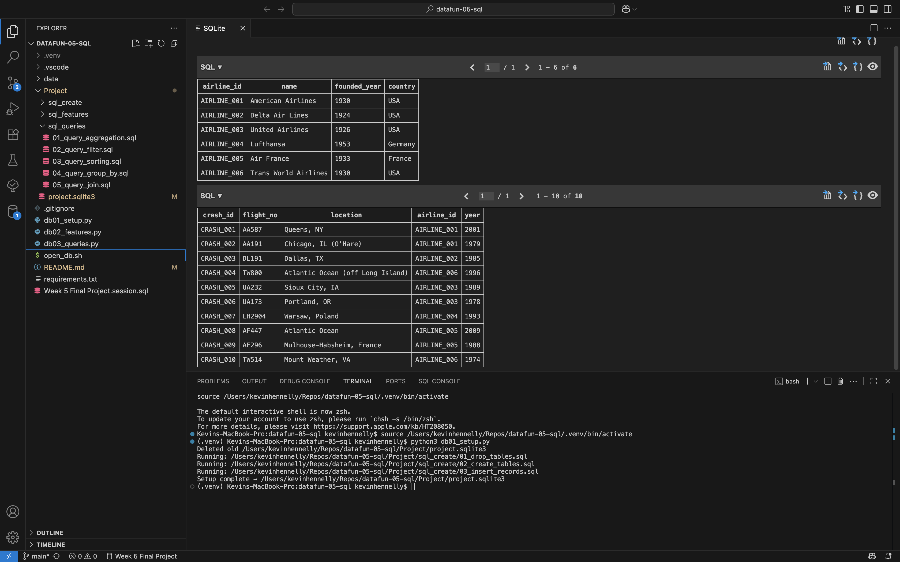
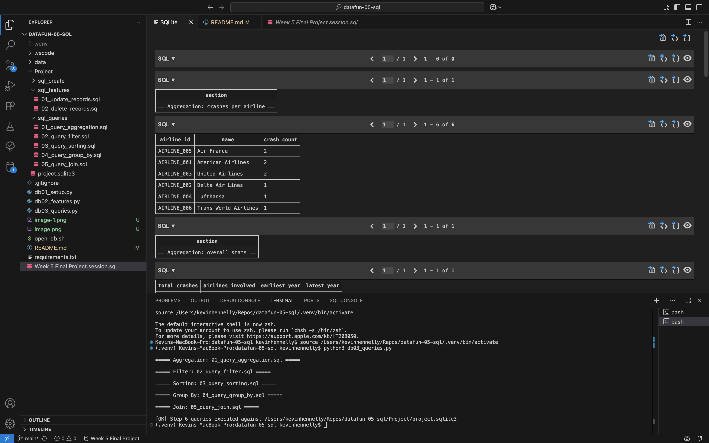
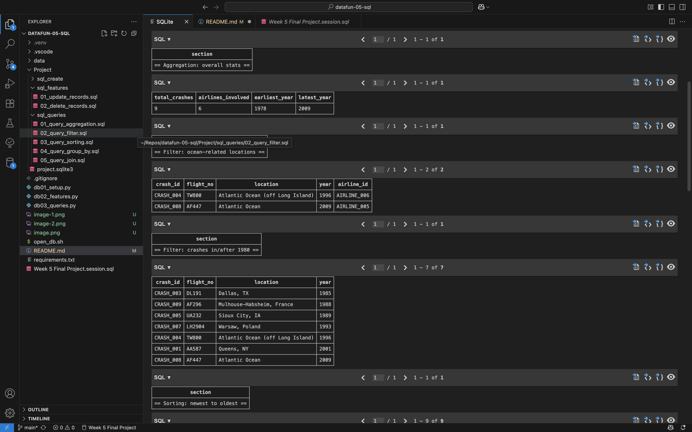
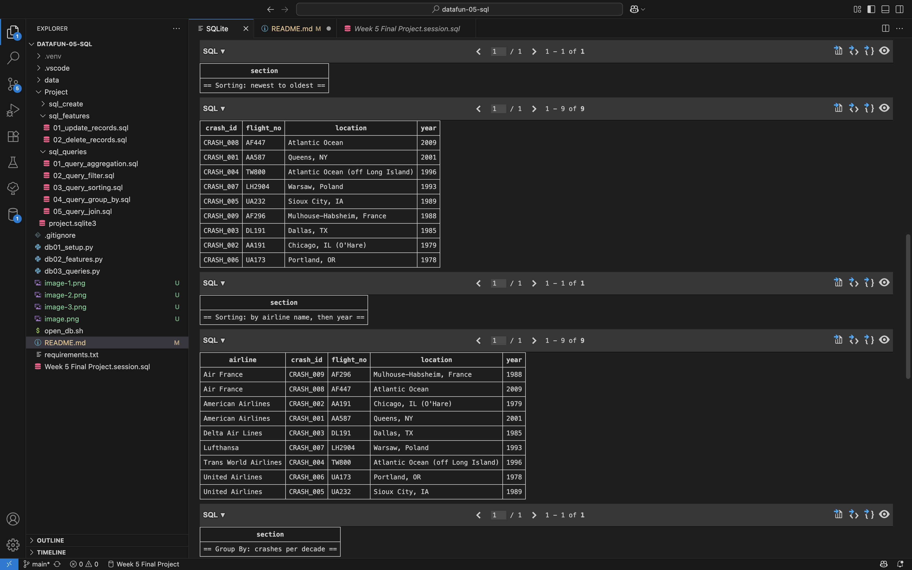
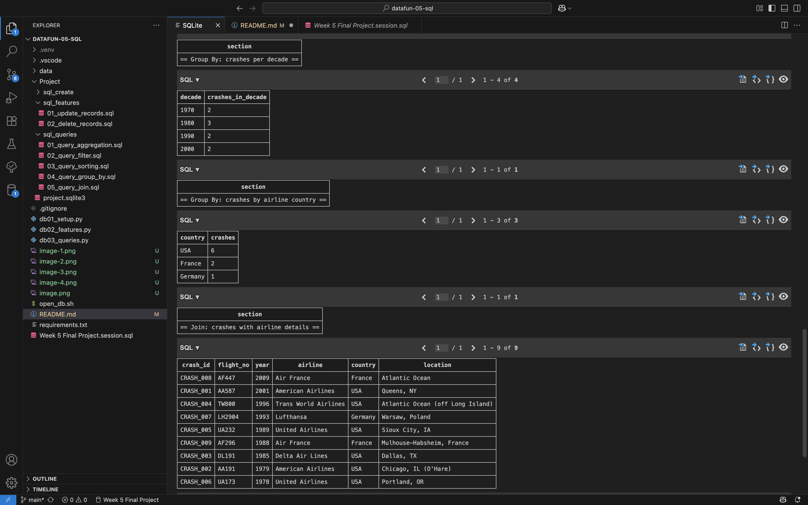
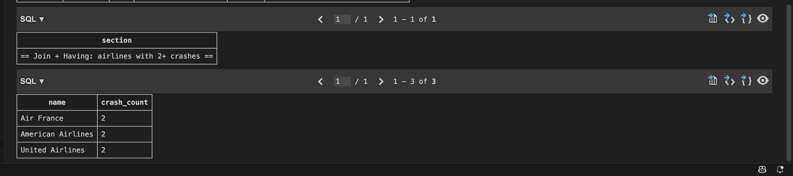

# datafun-05-sql
Northwest Data Analytics Fundamentals Week 5

## Activity (2025-09-18)

### Commands run
```
pip install -r requirements.txt
```

## Activity (2025-09-19)

### Commands run
```
# Recommended: use the setup script which creates the DB in `Project/`
python3 db01_setup.py

# Or, if using sqlite3 directly from the repo root, specify the Project path
sqlite3 Project/project.sqlite3
sqlite3 Project/project.sqlite3 < Project/sql_create/03_insert_records.sql
```

### Quick helper
```
# Make executable once:
chmod +x open_db.sh

# Then open the canonical DB in Project/
./open_db.sh
```

### Process
```
- Opened an interactive sqlite3 session against `project.sqlite3`.
- Imported records from `insert_records.sql` into `project.sqlite3` using input redirection.
```

### Notes
```
- Database `project.sqlite3` now contains tables and records created from the provided SQL scripts `create_tables.sql` and `insert_records.sql`.
- Viewer used: SQLTools
```

## Workflow Activity (2025-09-20)

### Setup and open
```
# Install dependencies
pip install -r requirements.txt

# Create/reset the canonical DB in Project/
python3 db01_setup.py

# Or use the helper which will create the DB if missing then open it
./open_db.sh
```

### Run queries and features
```
# Run an updated check for accuracy and deletes
python3 db02_features.py

# Run prepared queries and print results
python3 db03_queries.py
```

## Schema

The project uses a small relational schema with two tables: a parent `airlines` table and a child `crashes` table. Foreign keys are enforced via PRAGMA foreign_keys = ON.

### airlines
```
airline_id   TEXT PRIMARY KEY
name         TEXT NOT NULL
founded_year INTEGER CHECK (founded_year BETWEEN 1900 AND 2100)
country      TEXT
```

- airline_id: unique identifier for each airline (text-based to accommodate codes or UUIDs).
- name: airline name, required.
- founded_year: optional integer constrained to a reasonable range.
- country: optional text for the country of origin.

### crashes
```
crash_id   TEXT PRIMARY KEY
flight_no  TEXT
location   TEXT
airline_id TEXT NOT NULL REFERENCES airlines(airline_id)
year       INTEGER
```

- crash_id: unique identifier for each crash record.
- flight_no: flight number associated with the crash (if known).
- location: location description or airport.
- airline_id: required foreign key referencing `airlines(airline_id)`.
- year: integer year of the crash.

### Rationale
- Normalized design: airlines are modeled once in `airlines` and referenced from `crashes` to avoid duplication.
- Foreign key constraint enforces referential integrity between crashes and airlines.
- Simple checks (like `founded_year`) provide basic data validation at the DB level.

## Screenshots

### Initial Setup


### Check Accuracy of Data and Delete Features


### Query Aggregation


### Filtering


### Sorting


### Grouping and Joining


### Joining
