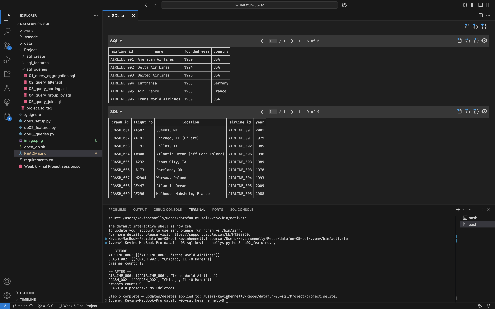

# datafun-05-sql
Northwest Data Analytics Fundamentals Week 5

## Activity (2025-09-18)

### Commands run
```
pip install -r requirements.txt
```

## Activity (2025-09-19)

### Commands run
```
# Recommended: use the setup script which creates the DB in `Project/`
python3 db01_setup.py

# Or, if using sqlite3 directly from the repo root, specify the Project path
sqlite3 Project/project.sqlite3
sqlite3 Project/project.sqlite3 < Project/sql_create/03_insert_records.sql
```

### Quick helper
```
# Make executable once:
chmod +x open_db.sh

# Then open the canonical DB in Project/
./open_db.sh
```

### Process
```
- Opened an interactive sqlite3 session against `project.sqlite3`.
- Imported records from `insert_records.sql` into `project.sqlite3` using input redirection.
```

### Notes
```
- Database `project.sqlite3` now contains tables and records created from the provided SQL scripts `create_tables.sql` and `insert_records.sql`.
- Viewer used: SQLTools
```

## Workflow

### Setup and open
```
# Install dependencies
pip install -r requirements.txt

# Create/reset the canonical DB in Project/
python3 db01_setup.py

# Or use the helper which will create the DB if missing then open it
./open_db.sh
```

### Run queries and features
```
# Run an updated check for accuracy and deletes
python3 db02_features.py

# Run prepared queries and print results
python3 db03_queries.py
```

## Screenshots

## Screenshots

### Initial Setup


### Update/Delete Features


### Before/After Snapshots


### Query Results


### Features Demo


### Aggregated Queries
